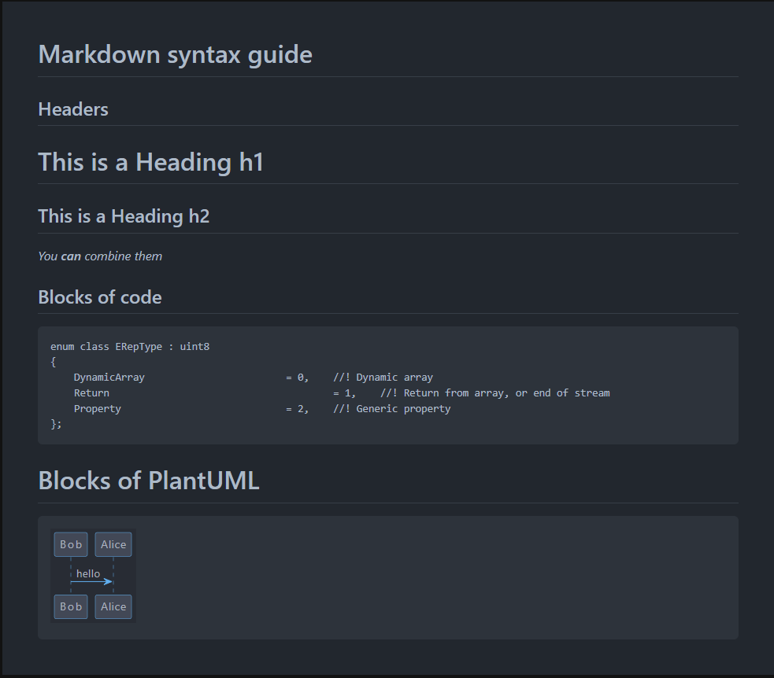

# Markdown Viewer with PlantUML

This program is a markdown viewer that supports PlantUML. It is implemented in JavaScript and designed to be used as a Chrome extension. The visual theme is based on the dark-dimmed theme used by Github. It was created for personal use.

## Sample
<div align="center">
<table cellpadding="5">
<tbody align="center">
<tr>
<td align="left">
<strong style="font-size: 12px;">
# Markdown syntax guide<br>
## Headers<br>
# This is a Heading h1<br>
## This is a Heading h2<br>
_You **can** combine them_
## Blocks of code<br>
```cpp<br>
enum class ERepType : uint8<br>
{<br>
	DynamicArray			= 0,	//! Dynamic array<br>
	Return					= 1,	//! Return from array, or end of stream<br>
	Property				= 2,	//! Generic property<br>
};<br>
```<br>
# Blocks of PlantUML<br>
```plantuml<br>
@startuml<br>
Bob -> Alice : hello<br>
@enduml<br>
```<br>
</strong>
</td>
<td>


</td>
</tr>
</tbody>
</table>
</div>


## Libraries
- [Marked](https://github.com/markedjs/marked) - Convert a markdown file into a Html document.
- [plantuml-encoder](https://github.com/markushedvall/plantuml-encoder) - PlantUML encoder for browsers and Node.js.
