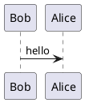

# Markdown syntax guide
## Headers
# This is a Heading h1
## This is a Heading h2
_You **can** combine them_
## Blocks of code
```cpp
enum class ERepType : uint8
{
	DynamicArray			= 0,	//! Dynamic array
	Return					= 1,	//! Return from array, or end of stream
	Property				= 2,	//! Generic property
};
```
# Blocks of PlantUML


```cpp
// MaxChannelSize는 32767이다.
const int32 UNetConnection::DEFAULT_MAX_CHANNEL_SIZE = 32767;

// Connection Header
TArray<UChannel*>	Channels;
TArray<int32>		OutReliable;
TArray<int32>		InReliable;
TArray<int32>		PendingOutRec;

// Connection Source (Initialize)
Channels.AddDefaulted(MaxChannelSize); // null로 채워진다.
OutReliable.AddDefaulted(MaxChannelSize);
InReliable.AddDefaulted(MaxChannelSize);
PendingOutRec.AddDefaulted(MaxChannelSize);
```